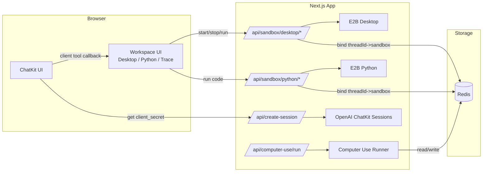

# 架构设计（ChatGPT 类 Agent 工作流 + 全栈应用 + E2B 沙箱）

本文档基于“OpenAI 托管工作流（Agent Builder）+ ChatKit 前端 + E2B Sandbox”的推荐集成路径，描述系统架构、数据流、关键模块职责以及后续扩展（Computer Use）。

## 1. 目标与范围

**MVP 目标**
1. ChatKit 聊天可用，连接至发布的 workflow（`wf_...`）。
2. 可显示工具调用/工作流痕迹（tool invocation）。
3. E2B Desktop 沙箱可用：后端创建、前端展示 VNC/noVNC stream，支持交互或只读。
4. E2B Python 解释器可用：后端执行代码、前端展示 stdout/stderr/富结果。
5. 沙箱生命周期管理：thread 绑定沙箱、超时回收。

**非 MVP（Phase 2）**
- Computer Use 自动操作（后端 loop：截图→模型→动作→执行）。
- 多人协作、权限、审计、计费等。

## 2. 系统架构总览

**三层结构**
1. **Web 应用（Next.js）**：ChatKit 主窗口 + Workspace（Desktop / Python / Trace）。
2. **App Backend（Next.js API routes）**：创建 ChatKit session、管理 E2B sandboxes、可选 Computer Use 执行器。
3. **状态存储（Redis，可选 Postgres）**：保存 thread→sandbox 绑定与 TTL；可扩展审计/回放。

## 3. 数据流与线程绑定

1. 前端加载时调用 `/api/create-session` → 后端创建 ChatKit session → 返回 `clientSecret`（10 分钟过期）。
2. ChatKit `onThreadChange` 返回 `threadId` → 前端保存到全局 store。
3. Desktop/Python 工具调用时携带 `threadId` → 后端查 Redis 复用或创建 sandbox。
4. Redis 使用 TTL（例如 30 分钟无活动回收）。

## 4. 工具分层与职责

### 4.1 Client Tools（前端处理）
- `ui.openTab({ tab })`：切换面板。
- `ui.notify({ level, message })`：系统提示。
- `sandbox.desktop.start({ threadId, viewOnly, requireAuth })`：触发后端 API，再打开 Desktop 面板。
- `sandbox.code.run({ threadId, code, timeoutSeconds })`：触发后端 API，再展示结果。

### 4.2 Server Tools（后端处理）
- `desktopStart/Stop/Status/Kill`：管理 E2B Desktop。
- `pythonCreate/Run/Kill`：管理 E2B Python。
- `computer_use.run`（Phase 2）：后端 loop 执行自动操作。

## 5. 关键安全与成本控制

- **API Key 仅服务端**：OpenAI/E2B 的 key 严禁下发前端。
- **VNC stream URL 不写日志**：仅返回前端显示。
- **TTL 与回收**：任何创建动作都写 Redis TTL；cron 任务周期性清理。
- **VNC iframe sandbox**：限制权限，避免跨域风险。

## 6. Phase 2：Computer Use 结构

**执行器循环**
1. `desktop.screenshot()` 捕获屏幕。
2. 调视觉模型生成动作。
3. `desktop.click/type/press` 执行动作。
4. 重复直到完成或达到 `maxSteps`。

**返回结构**
- `summary`：自然语言结果摘要。
- `steps[]`：动作与时间戳。
- `streamUrl`：便于用户旁观或接管。

---

如需更详细的接口规范与 schema，请参考 `docs/API_SPEC.md`。
